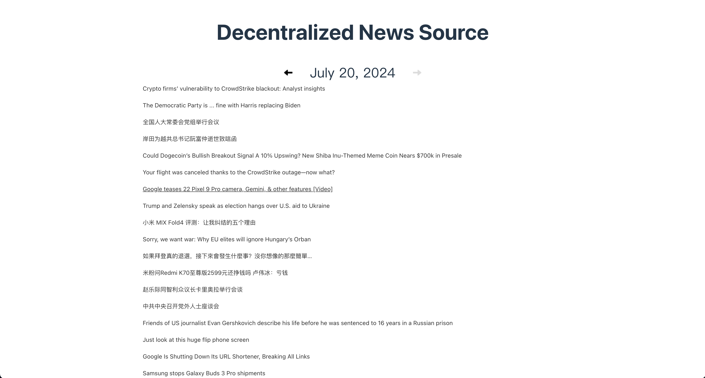
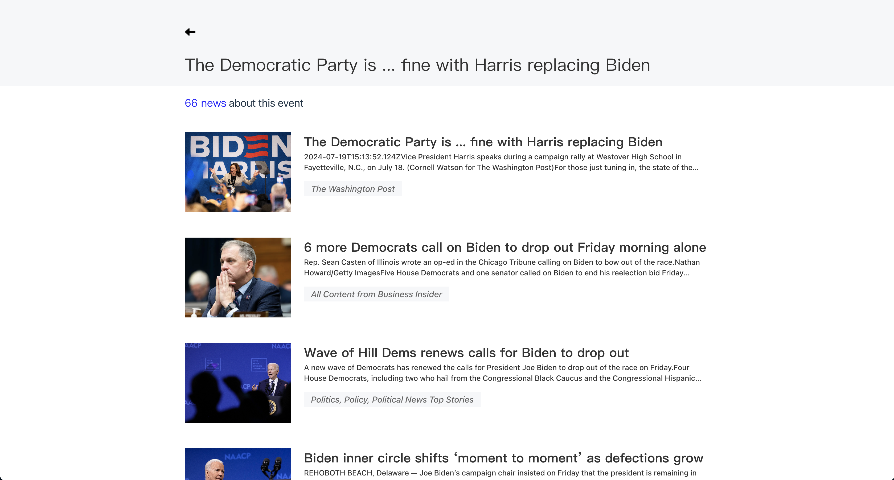

## Building a Decentralized News Reader Using Glitter Protocol

[Dailyfeeds](https://dailyfeeds.eth.limo/) just published a decentralized news data source available on [Glitter Protocol](https://glitterprotocol.io/). This valuable dataset allows everyone to build a decentralized news reader. The dataset contains news data crawled from various news sources. After performing incremental clustering, the news feeds are placed on Glitter Protocol.

Here is a step-by-step tutorial on how to create a decentralized news website using Glitter Protocol.

### Step 1 - Initialize the Project

First, you need to create a new project and install the Glitter SDK. This SDK allows easy connection to the Glitter network and access to mirror metadata.

```shell
npm install @glitterprotocol/glitter-sdk
```

### Step 2 - Connect to the Network

Next, generate a client so that the application can interact with the Glitter network. Initialize an LCDClient instance through the Glitter SDK and configure the relevant parameters.

```js
import {
  Coins,
  Numeric,
  LCDClient,
  MnemonicKey,
} from "@glitterprotocol/glitter-sdk";
const XIAN_HOST = "https://api.xian.glitter.link";
const CHAIN_ID = "glitter_12000-2";
const mnemonicKey =
  "lesson police usual earth embrace someone opera season urban produce jealous canyon shrug usage subject cigar imitate hollow route inhale vocal special sun fuel";

const client = new LCDClient({
  URL: XIAN_HOST,
  chainID: CHAIN_ID,
  gasPrices: Coins.fromString("0.15agli"),
  gasAdjustment: Numeric.parse(1.5),
});

const key = new MnemonicKey({
  mnemonic: mnemonicKey,
});

const dbClient = client.db(key);
```

### Step 3 - Build the News Retrieval Function

Retrieving news content is the core of the application. Define a function that constructs a query statement based on different news query times and sends it to the Glitter network to get news within the specified time range.

```js
const newsTable = "trna.cluster";
const newsColumns = "_id,size,title,content,image";
const timeStr = `to_time>=1721142000 and from_time<=1721232000 `;

const sql = `select ${newsColumns} from ${newsTable} where query_string(?) limit 0, 200`;
const newSql = prepareSQL(sql, timeStr);

const { result }: any = await dbClient.query(newSql);
const data = processDataModal(result);
```

### Step 4 - Display the News

With the news retrieval function in place, you'll need to present the results on your front-end interface. This involves creating a user interface that displays the news articles' details and includes interactive elements to facilitate easy browsing and selection.





By following these steps, you can build a decentralized news aggregation website using the Glitter Protocol. This platform will provide users with an efficient and convenient way to access a wide range of aggregated news articles without the constraints of centralized control.

The entire source code is available [here](https://github.com/glitternetwork/decentralized-news-tutorial).
